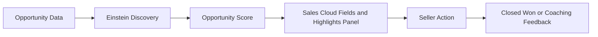
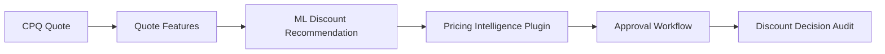
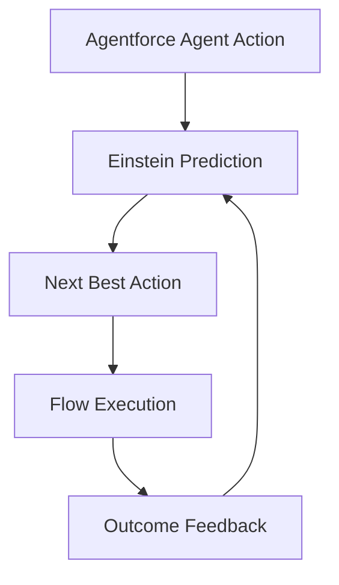

# Salesforce Einstein CPQ AI Patterns

Native Salesforce AI reference patterns for Einstein scoring, CPQ pricing intelligence, and Agentforce prompt design without external LLM dependencies.

> Reference architecture based on anonymized patterns from enterprise engagements. No client data included.

## Native AI Flows

## When to Use Einstein Natively vs External LLMs

Use Einstein natively when the task is predictive, CRM-centered, governed by Salesforce permissions, and benefits from standard Salesforce surfaces. Use external LLMs when the task requires broad generative reasoning, cross-system retrieval, or custom model orchestration.

| Need | Native Einstein Fit | External LLM Fit |
| --- | --- | --- |
| Opportunity win likelihood | High | Low, except explanation |
| Churn prediction | High | Low, except summarization |
| CPQ discount recommendation | High | Medium for narrative only |
| Case response drafting | Medium | High |
| Knowledge-grounded Q&A | Medium | High with RAG |
| Agent action orchestration | High with Agentforce | Medium with middleware |

## Repository Layout

- `salesforce/apex`: Einstein scoring, CPQ pricing intelligence, and churn trigger-handler examples.
- `salesforce/agentforce/prompt-templates`: Agentforce prompts for lead triage, case resolution, and CPQ quoting.
- `salesforce/flows`: Flow patterns for score thresholds, approvals, and notifications.
- `docs`: Architectural guidance for Einstein versus LLM selection and CPQ AI governance.

## Setup

1. Adapt field names to your Salesforce org and CPQ package version.
2. Configure Einstein Discovery or Prediction Builder outputs on Opportunity, Case, and Quote surfaces.
3. Deploy Apex examples into a Salesforce DX project.
4. Configure CPQ pricing and approval logic to consume the discount recommendation fields.
5. Register prompt templates in Agentforce and bind actions to governed Apex or Flow entry points.

The examples are intentionally anonymized and use standard Salesforce objects where possible.
